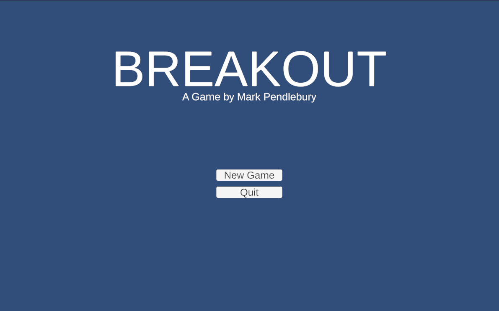
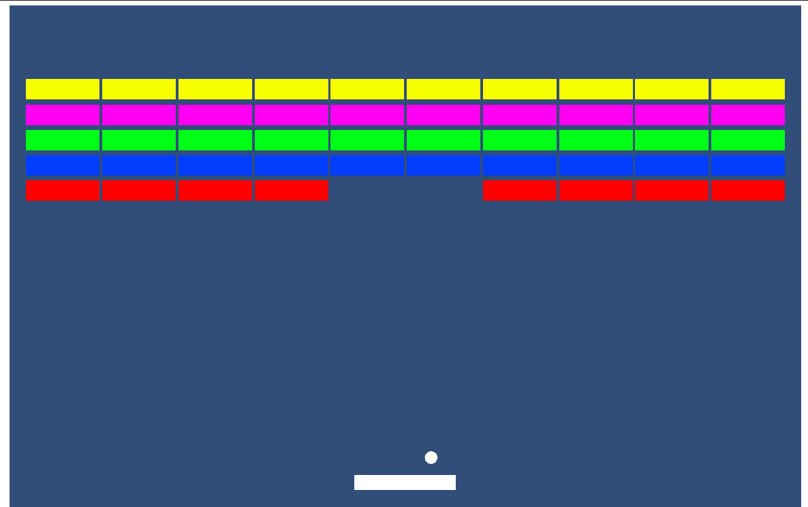
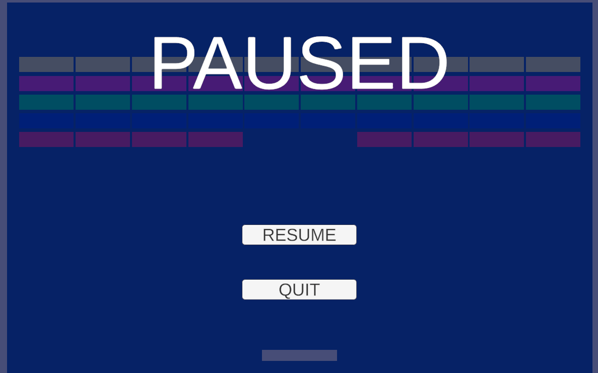

# Breakout

### What?
It's a Breakout clone. No fluff (maybe fluff to be added later as I gain more experience in Unity) Originally released in 1976 and published by Atari. This is my basic take on it.

### Why?
 I'm teaching myself unity, after spending a week learning the very basics of 2D game design in unity I decided to set my self a challenge of making a simple game in one day. As you can see from the commit history I did manage to get the core game mechanics complete in the first day, however an addition day was required to create the core game loop (game over, new game) and the main menu / pause menu. 

### Where?
Given Unitys cross platform nature it should compile on any platform. My main target environment is the SteamDeck therefore the game has a focus on the SD's features such as it's aspect ratio and inputs etc. I do plan on releasing a web version (once I figure out how to compile for WebGL) so I'll drop a link here or maybe embed it so you can play it.

### Features:

 - [x] Basic Breakout game
 - [x] Main Menu
 - [x] Pause Menu
 - [x] Game over detection
 - [x] Game win detection
 - [ ]  Countdown to start new game
 - [x]  Start new game on gameover/gamewin
 - [ ]  Points system
 - [ ] Additional levels / difficulties 
	 - [ ] Smaller racket
	 - [ ] Increase speed as time goes on
	 - [ ] Stronger bricks

### Screenshots

